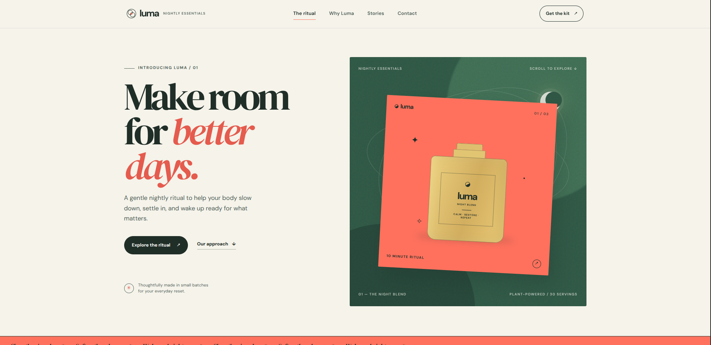
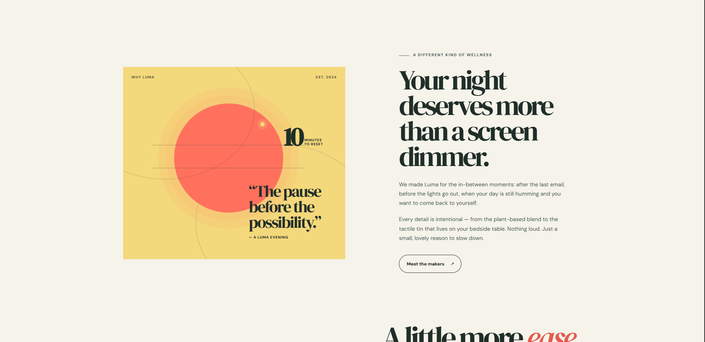
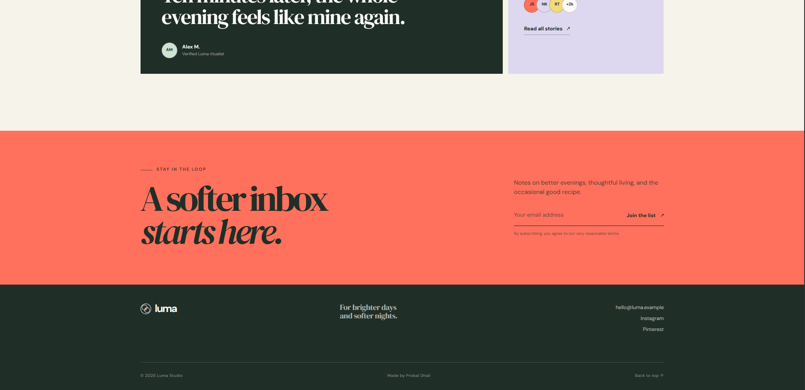

# ✦ Luma Studio — Landing Page

<div align="center">

  

  <h1>Luma Studio</h1>

  <p>A modern, responsive landing page crafted with clean design, thoughtful interactions, and a focus on user experience.</p>

  <p>
    
    
    
  </p>

  <p>
    <a href="https://github.com/probal2005">
      
    </a>
  </p>

</div>

---

## 📌 About the Project

**Luma Studio** is a modern landing page developed as part of my web development and design journey.

This project focuses on creating a visually appealing, responsive, and user-friendly website using core frontend technologies.

It demonstrates practical skills in website structure, styling, navigation, and interactive user experiences.

---

## ✨ Features

* 🎨 Modern and clean landing page design
* 📱 Responsive layout for desktop, tablet, and mobile
* ⚡ Lightweight frontend implementation
* 🧩 Organized HTML, CSS, and JavaScript files
* 🖼️ Custom visual assets and favicon
* 🧭 Smooth navigation and user-friendly layout
* 🔗 Developer GitHub profile integration

---

## 🖼️ Project Preview

### 01 - Demo Video

<video src="assets/videos/landing-page.mp4" width="100%" controls></video>

### 01 — Landing Page



### 02 — Website Design



### 03 — Responsive Experience



> Add your actual screenshots to `assets/images/` using the filenames above.

---

## 🛠️ Technologies Used

| Technology   | Purpose                        |
| ------------ | ------------------------------ |
| HTML5        | Website structure              |
| CSS3         | Styling and responsive layouts |
| JavaScript   | Interactive functionality      |
| SVG          | Favicon and scalable graphics  |
| Git & GitHub | Version control                |

---

## 📁 Project Structure

```text
Luma-Studio/
│
├── assets/
│   └── images/
│       ├── preview-1.png
│       ├── preview-2.png
│       └── preview-3.png
│
├── favicon.svg
│
├── index.html
│
├── styles.css
│
└── README.md
```

---

## 🚀 Getting Started

### Prerequisites

* A modern web browser
* VS Code or any code editor
* Git (optional)

### Installation

**1. Clone the repository**

```bash
git clone https://github.com/probal2005/OIBSIP/tree/main/WebDev-L1-T1-LandingPage
```

**2. Navigate to the project folder**

```bash
cd WebDev-L1-T1-LandingPage
```

**3. Run the project**

Open `index.html` in your browser.

For a better development experience, use the VS Code Live Server extension.

---

## 🌐 Live Preview

* **Live Website:** Add your deployed website link here.
* **GitHub Repository:** [Probal2005](https://github.com/probal2005)

---

## 🎯 Learning Objectives

* Learn and apply semantic HTML5.
* Build responsive layouts with CSS3.
* Practice JavaScript interactions.
* Organize a frontend project professionally.
* Improve UI/UX design skills.
* Understand Git and GitHub workflow.
* Develop a polished landing page from scratch.

---

## 🔮 Future Improvements

* [ ] Add more interactive animations.
* [ ] Improve accessibility.
* [ ] Optimize website performance.
* [ ] Add dark/light theme support.
* [ ] Deploy with a live domain.
* [ ] Improve mobile responsiveness.

---

## 👨‍💻 Developer

<div align="center">

  <h3>Made by Probal Dhali</h3>

  <p>AIML Student · Web Developer · Software Engineer in Progress</p>

  <a href="https://github.com/probal2005">
    
  </a>

<br><br>

  <p>Made with intention. Built with code.</p>

</div>

---

<div align="center">

⭐ If you like this project, consider giving it a star!

  <br>

© 2026 Luma Studio · Made by [Probal Dhali](https://github.com/probal2005)

</div>
