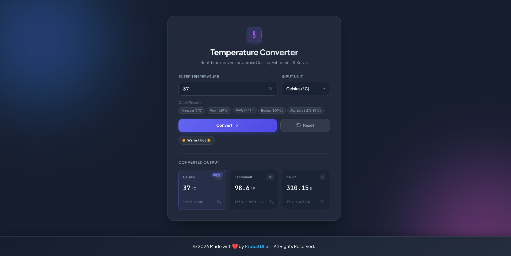

# 🌡️ Temperature Converter Website

A modern and responsive **Temperature Converter** built using HTML, CSS, and JavaScript as part of the **OASIS INFOBYTE Web Development & Designing Internship – Level 1, Task 3**.

The application converts temperatures between **Celsius, Fahrenheit, and Kelvin** in real time with validation, quick presets, thermal status detection, and copy-to-clipboard functionality.

---
</img>
---

## 👨‍💻 Internship Details

| Detail | Information |
|---|---|
| **Organization** | OASIS INFOBYTE |
| **Name** | Probal Dhali |
| **Track** | 🌐 Web Development & Designing |
| **Level** | Level 01 |
| **Task** | Task 03 |
| **Project** | Temperature Converter Website |

---

## ✨ Features

- 🌡️ Convert between **Celsius, Fahrenheit, and Kelvin**
- ⚡ Real-time temperature conversion
- 🎯 Quick temperature presets
- ❄️ Freezing point preset
- 🏠 Room temperature preset
- ❤️ Body temperature preset
- 🔥 Boiling point preset
- 🧊 Absolute zero detection
- ⚠️ Input validation and error messages
- 📋 Copy converted values to clipboard
- 🔄 Reset button
- 📱 Responsive design
- 🎨 Modern and clean user interface
- ♿ Accessible form labels and ARIA attributes
- 🌐 Google Fonts integration
- 🧮 Accurate temperature conversion formulas

---

## 🖥️ Technologies Used

- **HTML5** — Website structure
- **CSS3** — Styling and responsive design
- **JavaScript** — Conversion logic and interactions
- **SVG** — Interface icons
- **Google Fonts** — Plus Jakarta Sans & JetBrains Mono

---

## 🔢 Conversion Formulas

### Celsius → Fahrenheit

```text
°F = (°C × 9/5) + 32


### Celsius → Kelvin

```text
K = °C + 273.15
```

### Fahrenheit → Celsius

```text
°C = (°F − 32) × 5/9
```

### Fahrenheit → Kelvin

```text
K = (°F − 32) × 5/9 + 273.15
```

### Kelvin → Celsius

```text
°C = K − 273.15
```

### Kelvin → Fahrenheit

```text
°F = (K − 273.15) × 9/5 + 32
```

---

## 📁 Project Structure

```text
Temperature Converter Website/
│
├── index.html
├── style.css
├── script.js
└── README.md
```

### File Description

| File         | Description                                          |
| ------------ | ---------------------------------------------------- |
| `index.html` | Main webpage structure                               |
| `style.css`  | Styling, layout, animations, and responsive design   |
| `script.js`  | Temperature conversion and interactive functionality |
| `README.md`  | Project documentation                                |

---

## 🎨 Interface

The application contains:

1. **Header Section**

   * Temperature icon
   * Project title
   * Project description

2. **Temperature Input**

   * Temperature value input
   * Unit selection

3. **Quick Presets**

   * Freezing
   * Room temperature
   * Body temperature
   * Boiling
   * Absolute zero

4. **Conversion Controls**

   * Convert button
   * Reset button

5. **Thermal Status**

   * Displays the current thermal condition

6. **Converted Output**

   * Celsius
   * Fahrenheit
   * Kelvin

7. **Copy Function**

   * Copy individual conversion results

8. **Footer**

   * Developer information
   * GitHub profile

---

## 🚀 How to Run

### 1. Clone the Repository

```bash
git clone https://github.com/probal2005/OIBSIP/tree/main/WebDev-L1-T2-TemperatureConverterWebsite
```

### 2. Open the Project

```bash
cd "Temperature Converter Website"
```

### 3. Run the Website

You can simply open:

```text
index.html
```

in your web browser.

Alternatively, use **VS Code Live Server** for development.

---

## 🧪 Example

For an input of:

```text
25 °C
```

The converter produces approximately:

```text
Celsius:     25 °C
Fahrenheit:  77 °F
Kelvin:      298.15 K
```

---

## 📸 Project Preview

### 🌡️ Temperature Converter

*Add your project screenshot here.*

```markdown

```

---

## 🎥 Demo

*Add your demo GIF here if you have one.*

```markdown

```

---

## 👨‍💻 Developer

**Probal Dhali**

🌐 Web Development & Designing
🎓 OASIS INFOBYTE Internship — Level 01

[](https://github.com/Probal2005)

---

## 📜 Internship Task

This project was developed as part of the **OASIS INFOBYTE Web Development & Designing Internship**.

**Level 01 — Task 03: Temperature Converter Website**

---

## ⭐ Acknowledgement

Thanks to **OASIS INFOBYTE** for providing the opportunity to develop practical web development skills through internship projects.

---

## 📄 License

This project is created for educational and internship purposes.

© 2026 Probal Dhali. All Rights Reserved.

````

### Your final folder

Since you currently have only three files, I recommend keeping it simple:

```text
TASK 3 · Temperature Converter Website/
├── index.html
├── style.css
├── script.js
└── README.md
````
