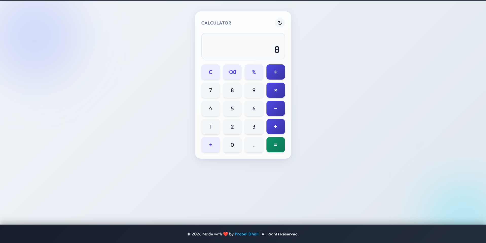
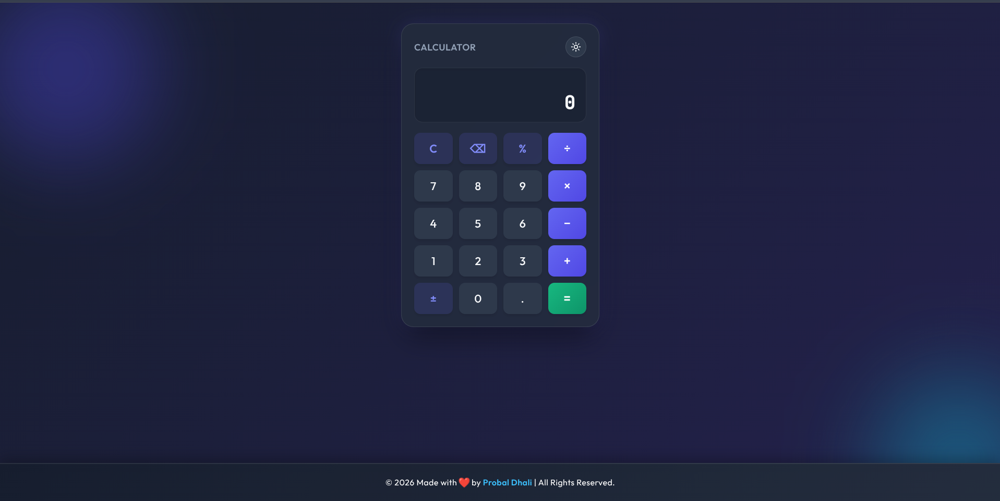

# 🧮 Modern Calculator

A modern, responsive calculator web application built using **HTML, CSS, and JavaScript**. The calculator features a clean user interface, basic arithmetic operations, keyboard-friendly controls, and a **Light/Dark theme toggle**.

This project was created as part of the **OASIS INFOBYTE Web Development & Designing Internship – Level 2, Task 1**.

---

## 👨‍💻 Internship Details

| Detail | Information |
|---|---|
| **Organization** | OASIS INFOBYTE |
| **Name** | Probal Dhali |
| **Track** | 🌐 Web Development & Designing |
| **Level** | Level 02 |
| **Task** | Task 01 |
| **Project** | Modern Calculator |

---

## ✨ Features

- 🧮 Basic arithmetic operations
- ➕ Addition
- ➖ Subtraction
- ✖️ Multiplication
- ➗ Division
- % Percentage calculation
- ± Positive/negative toggle
- ⌫ Backspace functionality
- 🔄 Clear calculator
- 🔢 Decimal number support
- 🌞 Light theme
- 🌙 Dark theme
- 🎨 Modern glass-style interface
- 📱 Responsive design
- ⚡ Fast JavaScript-based calculations
- 🧑‍💻 Developer information in footer

---

## 🖥️ Technologies Used

- **HTML5** — Structure
- **CSS3** — Styling and responsive layout
- **JavaScript** — Calculator logic and interactions
- **SVG** — Theme and interface icons
- **Google Fonts**
  - Outfit
  - JetBrains Mono

---

## 📸 Project Preview

### 🌞 Light Theme

<p align="center">
  
</p>

### 🌙 Dark Theme

<p align="center">
  
</p>

---

## 🎨 Theme Support

The calculator includes two visual themes.

### 🌞 Light Theme

The Light Theme provides a bright and clean interface for comfortable daytime use.

### 🌙 Dark Theme

The Dark Theme provides a darker interface designed for a comfortable viewing experience in low-light environments.

Use the **sun/moon button** in the top-right corner of the calculator to switch between themes.

---

## 🔢 Calculator Operations

The calculator supports:

```text
Addition        +
Subtraction     −
Multiplication  ×
Division        ÷
Percentage      %
Sign Toggle     ±
Decimal         .
Clear           C
Backspace       ⌫
Calculate       =
````

---

## 📁 Project Structure

```text
TASK 1 · Calculator/
│
├── index.html
├── style.css
├── script.js
├── README.md
│
└── assets/
    └── images/
        ├── calculator-light.png
        └── calculator-dark.png
```

---

## 📄 File Description

| File                   | Description                                                   |
| ---------------------- | ------------------------------------------------------------- |
| `index.html`           | Main calculator structure                                     |
| `style.css`            | Calculator design, themes, animations, and responsive styling |
| `script.js`            | Calculator functionality and theme switching                  |
| `README.md`            | Project documentation                                         |
| `calculator-light.png` | Light theme screenshot                                        |
| `calculator-dark.png`  | Dark theme screenshot                                         |

---

## 🚀 How to Run

### 1. Clone the Repository

```bash
git clone YOUR_REPOSITORY_URL
```

### 2. Open the Project

```bash
cd "TASK 1 · Calculator"
```

### 3. Run the Website

Simply open:

```text
index.html
```

in your web browser.

You can also use **VS Code Live Server** for development.

---

## 🧪 Example Calculation

For example:

```text
25 + 15
```

Output:

```text
40
```

Another example:

```text
100 ÷ 4
```

Output:

```text
25
```

---

## 🎥 Demo

If you create a GIF demonstration, add it here:

```markdown

```

---

## 👨‍💻 Developer

**Probal Dhali**

🌐 Web Development & Designing
🎓 OASIS INFOBYTE Internship — Level 02

[](https://github.com/Probal2005)

---

## 📜 Internship Task

This project was developed as part of the:

**OASIS INFOBYTE Web Development & Designing Internship**

**Level 02 — Task 01: Calculator**

---

## ⭐ Acknowledgement

Thanks to **OASIS INFOBYTE** for providing the opportunity to develop practical web development skills through internship projects.

---

## 📄 License

This project is created for educational and internship purposes.

© 2026 Probal Dhali. All Rights Reserved.

````

### 📂 Create the preview folders

From your current directory:

```bash
mkdir -p assets/images
````

Then take **two screenshots** of your calculator:

```text
assets/images/calculator-light.png
assets/images/calculator-dark.png
```

Your final structure will be:

```text
TASK 1 · Calculator/
├── index.html
├── script.js
├── style.css
├── README.md
└── assets/
    └── images/
        ├── calculator-light.png
        └── calculator-dark.png
```

Then push everything:

```bash
git add .
git commit -m "Add calculator README and theme previews"
git push origin main
```

The README will then display the **Light Theme and Dark Theme screenshots directly** on GitHub.
