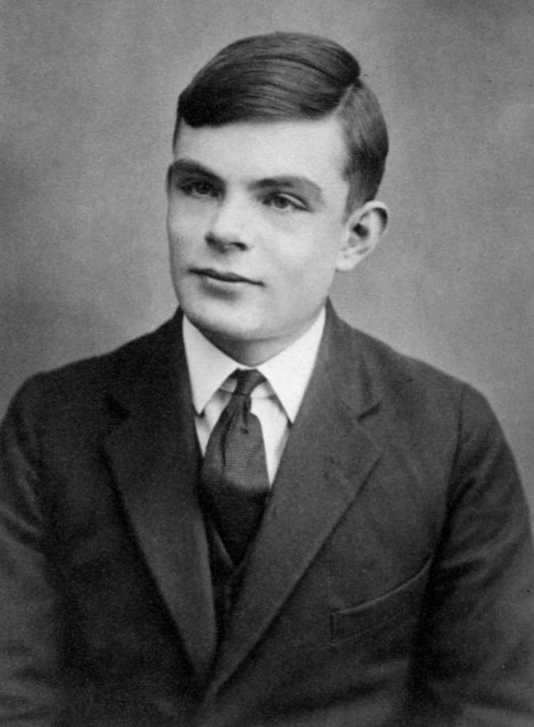
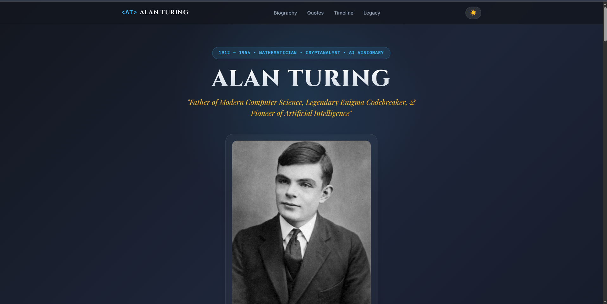
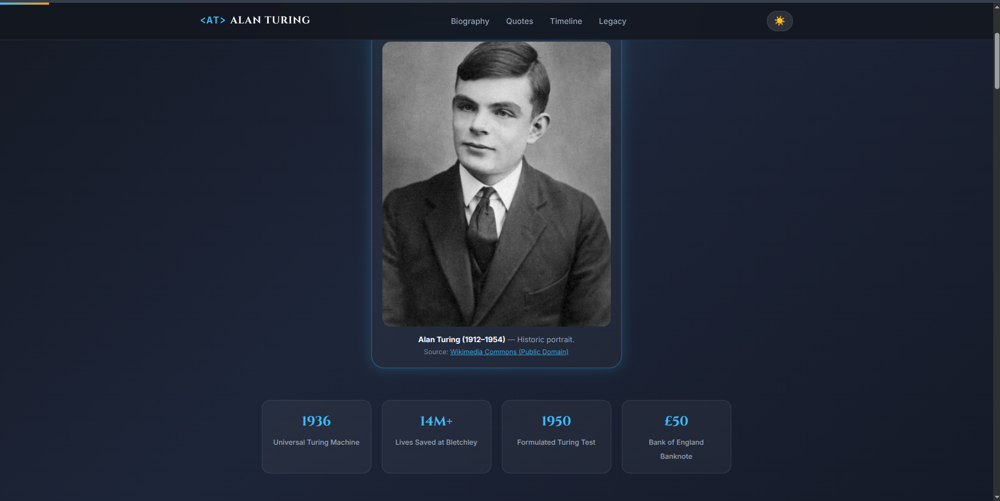
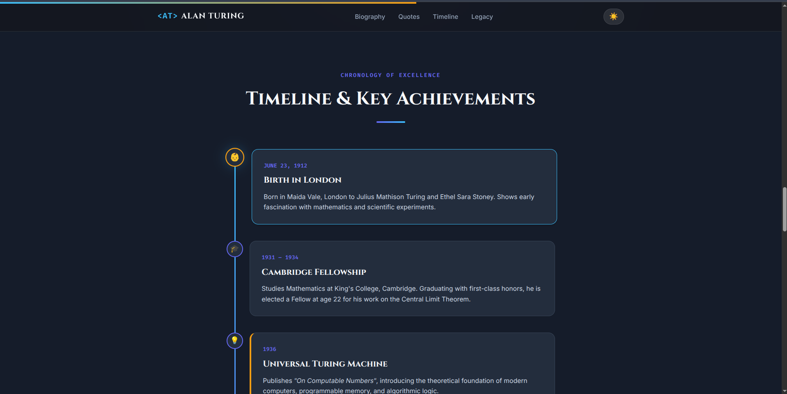
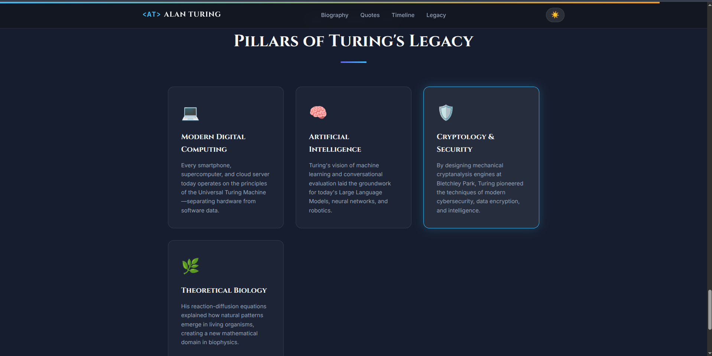

# 🧠 Alan Turing — Tribute Page

<p align="center">
  <strong>A Tribute to the Father of Modern Computer Science & AI Pioneer</strong>
</p>

<p align="center">
  
</p>

---

## 📌 Project Overview

This project is a modern and responsive **Tribute Page dedicated to Alan Mathison Turing (1912–1954)**, one of the most influential mathematicians, cryptanalysts, and computing pioneers in history.

The page presents Alan Turing's life, achievements, scientific contributions, World War II codebreaking work, Artificial Intelligence concepts, and lasting legacy through an interactive and visually designed web experience.

The project was created using **HTML5, CSS3, and JavaScript**.

---

## 🎓 Internship Details

| Detail | Information |
|---|---|
| **Organization** | OASIS INFOBYTE |
| **Track** | Web Development & Designing |
| **Level** | Level 02 |
| **Task** | Task 02 |
| **Project** | Tribute Page |
| **Subject** | Alan Turing |
| **Developer** | Probal Dhali |

---

## ✨ Features

### 🧠 Alan Turing Biography
The page contains detailed sections covering:

- Early life and mathematical achievements
- Universal Turing Machine
- Bletchley Park and Enigma codebreaking
- Foundations of Artificial Intelligence
- The Turing Test
- Post-war contributions
- His persecution and historical recognition

The biography is organized into multiple content cards for easier reading. 

---

### 📜 Interactive Timeline

A chronological timeline highlights important events in Turing's life and career, including:

- 👶 Birth in 1912
- 🎓 Cambridge Fellowship
- 💡 Universal Turing Machine — 1936
- 🏛️ PhD at Princeton — 1938
- 🔐 Enigma codebreaking — 1939–1945
- 🖥️ ACE Computer Design — 1946
- 🤖 Turing Test — 1950
- 🧬 Mathematical Morphogenesis — 1952
- 🏆 ACM Turing Award
- 💷 Royal Pardon and £50 Note

---

### 💬 Quote Carousel

The website includes an interactive quote section with:

- Previous quote button
- Next quote button
- Quote navigation dots
- Animated quote display

---

### 🌙 Light & Dark Theme

A theme toggle allows visitors to switch between different visual modes.

```text
🌙 Dark Mode
☀️ Light Mode
````

The theme button is implemented using JavaScript and provides a better browsing experience.

---

### 📊 Quick Statistics

The hero section contains key information about Alan Turing, including:

* **1936** — Universal Turing Machine
* **14M+** — Lives Saved at Bletchley
* **1950** — Turing Test
* **£50** — Bank of England Banknote

---

### 🏛️ Legacy Section

The project highlights four major areas influenced by Turing:

* 💻 Modern Digital Computing
* 🧠 Artificial Intelligence
* 🛡️ Cryptology & Security
* 🌿 Theoretical Biology

---

### 🔝 Back to Top

A **Back to Top** button is included at the bottom of the page to make navigation easier.

```text
↑ Back to Top
```

---

## 🛠️ Technologies Used

| Technology            | Purpose                                            |
| --------------------- | -------------------------------------------------- |
| **HTML5**             | Website structure and semantic elements            |
| **CSS3**              | Styling, layouts, animations and responsive design |
| **JavaScript**        | Theme toggle, quote carousel and interactions      |
| **SVG**               | Interface icons                                    |
| **Google Fonts**      | Typography                                         |
| **Wikimedia Commons** | Public-domain Alan Turing image                    |

The project uses **Cinzel, Inter, Fira Code, and Playfair Display** typography. 

---

## 📁 Project Structure

```text
TASK 2 · Tribute Page/
│
├── assets/
│   └── images/
│       └── alan-turing.jpg
│
├── index.html
├── script.js
├── style.css
└── README.md
```

---

## 📄 File Description

### `index.html`

Contains the complete structure of the website:

* Navigation bar
* Hero section
* Alan Turing portrait
* Biography
* Quotes
* Timeline
* Legacy
* Footer
* Theme toggle
* Back to Top button

The Alan Turing image is loaded from:

```html
assets/images/alan-turing.jpg
```


---

### `style.css`

Responsible for:

* Page layout
* Typography
* Colors
* Responsive design
* Cards
* Timeline styling
* Navigation
* Light/Dark theme
* Animations
* Footer styling

---

### `script.js`

Responsible for interactive functionality such as:

* Theme switching
* Quote carousel
* Quote navigation
* Back to Top functionality
* Scroll-based interactions

---

## 🖼️ Project Preview

---

<p align="center">
  
</p>

---

<p align="center">
  
</p>

---

<p align="center">
  
</p>

---

<p align="center">
  
</p>

---

> **Note:** Add your actual screenshots to `assets/images/` using these filenames:
>
> `preview1.png`
>
> `preview2.png`
>
> `preview3.png`
>
> `preview4.png`

---

## 🎨 Design Highlights

The website uses a modern editorial-inspired interface with:

* Responsive navigation
* Large hero typography
* Glass-style cards
* Timeline-based storytelling
* Section dividers
* Interactive controls
* Smooth transitions
* Light and dark visual themes
* Responsive mobile layout

---

## 🚀 How to Run

### 1. Clone the repository

```bash
git clone https://github.com/Probal2006/tribute-page.git
```

### 2. Enter the project directory

```bash
cd tribute-page
```

### 3. Open the website

You can simply open:

```text
index.html
```

in your browser.

### Or use a local server

If you have Python installed:

```bash
python3 -m http.server 8000
```

Then open:

```text
http://localhost:8000
```

---

## 🌐 Website Sections

```text
Home
 │
 ├── Biography
 │
 ├── Quotes
 │
 ├── Timeline
 │
 └── Legacy
```

The navigation menu directly connects to the Biography, Quotes, Timeline, and Legacy sections. 

---

## 📚 Main Topics Covered

The project explores Alan Turing's contribution to:

* Computer Science
* Computability Theory
* Artificial Intelligence
* Cryptanalysis
* Machine Intelligence
* Mathematical Biology
* Digital Computing

---

## 🖼️ Image Credits

The Alan Turing portrait used in the project is credited to **Wikimedia Commons** and is identified in the webpage as public-domain content. 

---

## 📱 Responsive Design

The website is designed to work across:

* 💻 Desktop
* 💻 Laptop
* 📱 Mobile
* 📟 Tablet

The HTML includes a responsive viewport configuration for mobile devices. 

---

## 🔐 Accessibility

The project includes accessibility-friendly features such as:

* Semantic HTML structure
* Descriptive image `alt` text
* ARIA labels for interactive buttons
* Keyboard-friendly controls
* Clear navigation
* Readable typography

For example, the theme toggle and Back to Top button include descriptive `aria-label` attributes.  

---

## 👨‍💻 Developer

**Probal Dhali**

Web Development & Designing Intern
OASIS INFOBYTE

### GitHub

🔗 [https://github.com/Probal2006](https://github.com/Probal2006)

---

## 🎯 Internship Task

This project was developed as part of the:

**OASIS INFOBYTE Web Development & Designing Internship**

### Level 02 — Task 02

**Task:** Tribute Page

---

## 🙏 Acknowledgement

Special thanks to **OASIS INFOBYTE** for providing the opportunity to work on practical web development projects and improve frontend development skills through hands-on tasks.

---

## 📜 License

This project was created for educational and internship purposes.

The website code is developed by **Probal Dhali**.

Third-party content, images, and references remain subject to their respective licenses and sources.

---

<p align="center">
  Made with ❤️ using HTML5, CSS3 & JavaScript
</p>

<p align="center">
  © 2026 Probal Dhali
</p>
```

### Important

Your current folder only contains:

```text
assets/images/alan-turing.jpg
index.html
script.js
style.css
```

So **before pushing the README**, if you want the two preview sections to actually display, create:

```text
assets/
└── images/
    ├── alan-turing.jpg
    ├── preview1.png
    └── preview2.png
```

