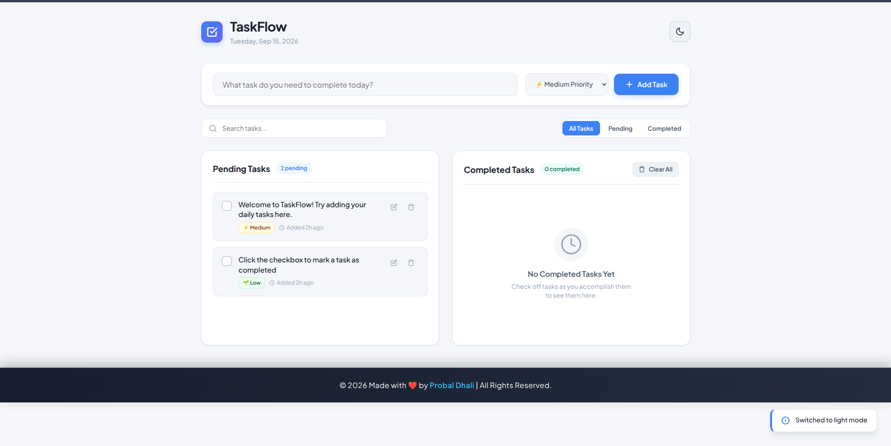
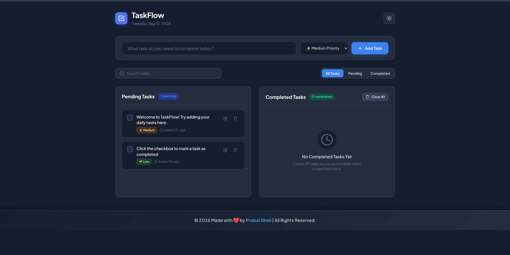

# 📋 TaskFlow — Interactive To-Do Web App

<p align="center">
  <strong>Organize your tasks. Prioritize your day. Get things done.</strong>
</p>

<p align="center">
  A modern, responsive and interactive To-Do application built with HTML5, CSS3 and JavaScript.
</p>

---

## 📌 Project Overview

**TaskFlow** is an interactive To-Do web application designed to help users organize and manage their daily tasks efficiently.

The application provides a clean dashboard for creating tasks, assigning priorities, searching and filtering tasks, tracking pending and completed work, switching between light and dark themes, and clearing completed tasks.

The interface is designed around two task columns:

* 📋 Pending Tasks
* ✅ Completed Tasks

---

## ✨ Features

### 📝 Task Management

* Add new tasks quickly
* Mark tasks as completed
* Move completed tasks between task lists
* Delete or manage tasks
* Clear all completed tasks
* Empty-state messages when no tasks are available

### ⚡ Task Priority

Each task can be assigned a priority:

* 🔥 **High Priority**
* ⚡ **Medium Priority**
* 🌱 **Low Priority**

This makes it easier to organize tasks according to importance.

### 🔍 Search Tasks

Use the built-in search box to quickly find specific tasks.

```text
Search tasks...
```

The search interface also includes a clear-search button.

### 🗂️ Task Filters

Tasks can be filtered using:

```text
All Tasks | Pending | Completed
```

This makes it easy to focus on a particular type of task.

### 🌙 Light & Dark Theme

TaskFlow includes a theme toggle for switching between:

```text
☀️ Light Theme
🌙 Dark Theme
```

The theme control is accessible through the header.

### 📊 Task Dashboard

The dashboard separates tasks into:

```text
┌─────────────────────┬─────────────────────┐
│   Pending Tasks     │  Completed Tasks    │
│                     │                     │
│   Active Work       │   Finished Work     │
└─────────────────────┴─────────────────────┘
```

Each column displays a live task count.

### 🔔 Toast Notifications

The application includes a dedicated toast notification container for displaying user feedback and status messages.

### 📱 Responsive Design

The interface is designed to provide a consistent experience across:

* 💻 Desktop
* 💻 Laptop
* 📱 Mobile
* 📟 Tablet

---

## 🛠️ Technologies Used

| Technology       | Purpose                                       |
| ---------------- | --------------------------------------------- |
| **HTML5**        | Website structure and semantic elements       |
| **CSS3**         | Styling, layout, themes and responsive design |
| **JavaScript**   | Task management and application interactions  |
| **SVG**          | Interface icons                               |
| **Google Fonts** | Modern typography                             |

The project uses **Plus Jakarta Sans** for its typography.

---

## 📁 Project Structure

```text
TASK 3 · To-Do Web App/
│
├── index.html
├── styles.css
├── app.js
└── README.md
```

---

## 📄 File Description

### `index.html`

Contains the main application structure, including:

* Application header
* Task creation form
* Priority selector
* Search box
* Task filters
* Pending tasks section
* Completed tasks section
* Clear completed button
* Footer
* Toast notification container

---

### `styles.css`

Responsible for the application's visual presentation:

* Layout
* Colors
* Typography
* Light/Dark themes
* Buttons
* Task cards
* Dashboard columns
* Responsive design
* Animations and transitions

---

### `app.js`

Controls the application's interactive functionality, including:

* Adding tasks
* Managing task status
* Task filtering
* Task searching
* Priority handling
* Theme switching
* Clearing completed tasks
* Toast notifications
* Dynamic task counters

---

## 🎨 Interface Sections

### 1. Application Header

The header contains:

* TaskFlow branding
* Task icon
* Current-date display
* Light/Dark theme toggle

---

### 2. Task Creator

Users can create a task using:

```text
What task do you need to complete today?
```

A priority can then be selected before clicking:

```text
+ Add Task
```

---

### 3. Search & Filters

The toolbar provides:

```text
🔍 Search tasks...
```

and three filters:

```text
All Tasks
Pending
Completed
```

---

### 4. Pending Tasks

Displays tasks that still need to be completed.

When there are no pending tasks, TaskFlow displays:

```text
No Pending Tasks

You're all caught up!
Add a new task above to get started.
```

---

### 5. Completed Tasks

Displays finished tasks and provides a:

```text
🗑 Clear All
```

button for removing completed tasks.

---

## 🚀 How to Run

### Option 1 — Open Directly

Open the following file in your browser:

```text
index.html
```

---

### Option 2 — Run Using a Local Server

From the project directory:

```bash
python3 -m http.server 8000
```

Then open:

```text
http://localhost:8000
```

---

## 💡 Example Workflow

```text
1. Enter a task
        ↓
2. Select priority
        ↓
3. Click "Add Task"
        ↓
4. Task appears under Pending Tasks
        ↓
5. Complete the task
        ↓
6. Task moves to Completed Tasks
```

---

## 🔎 Example Tasks

| Task                                | Priority | Status    |
| ----------------------------------- | -------- | --------- |
| Complete Web Development Assignment | 🔥 High  | Pending   |
| Practice JavaScript                 | ⚡ Medium | Pending   |
| Read Documentation                  | 🌱 Low   | Completed |

---

## 🖼️ Project Preview

### ☀️ Light Theme

<p align="center">
  
</p>

---

### 🌙 Dark Theme

<p align="center">
  
</p>

> **Note:** Add your actual screenshots using these filenames:
>
> `assets/images/taskflow-light.png`
>
> `assets/images/taskflow-dark.png`

If you don't have screenshots yet, remove the preview section until you create them.

---

## ♿ Accessibility

TaskFlow uses accessibility-focused HTML features such as:

* Semantic HTML elements
* Descriptive `aria-label` attributes
* Accessible buttons
* Keyboard-friendly form controls
* Meaningful placeholders
* Accessible task lists
* ARIA live notifications

---

## 🎯 Key Learning Outcomes

This project demonstrates practical knowledge of:

* HTML5 semantic structure
* CSS responsive layouts
* JavaScript DOM manipulation
* Event handling
* Form handling
* Dynamic UI updates
* Search functionality
* Filtering logic
* Theme switching
* Task-state management
* Accessibility
* Modern frontend UI design

---

## 👨‍💻 Developer

**Probal Dhali**

Web Development & Designing

### GitHub

🔗 [https://github.com/Probal2005](https://github.com/Probal2005)

---

## 📌 Project Status

```text
🟢 Completed
```

The project is built as a frontend web application using standard web technologies and does not require a backend server or database.

---

## 🙏 Acknowledgement

This project was developed as part of practical web development learning and internship work.

Special thanks to **OASIS INFOBYTE** for providing hands-on opportunities to practice and improve frontend development skills.

---

## 📜 License

This project is created for **educational and internship purposes**.

© 2026 Probal Dhali. All Rights Reserved.

---

<p align="center">
  Made with ❤️ using HTML5, CSS3 & JavaScript
</p>

<p align="center">
  <strong>TaskFlow — Organize. Prioritize. Complete.</strong>
</p>
```
