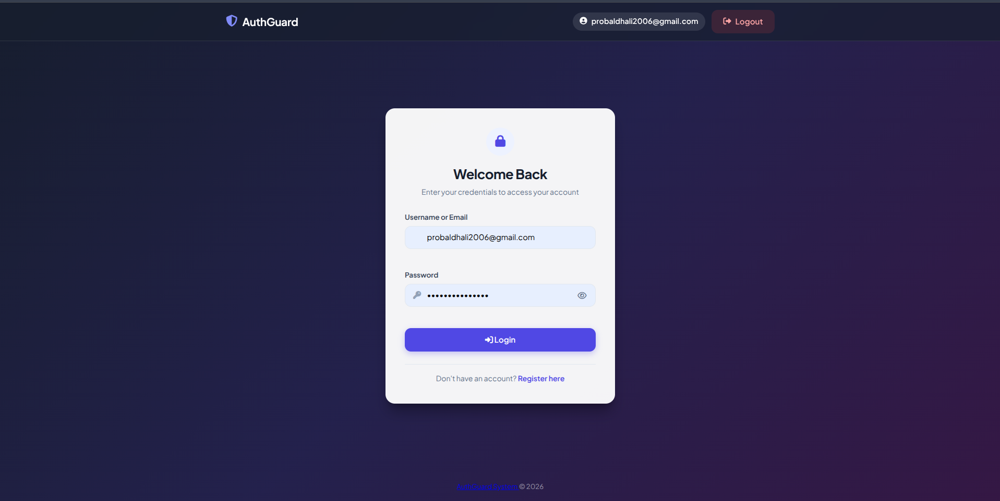
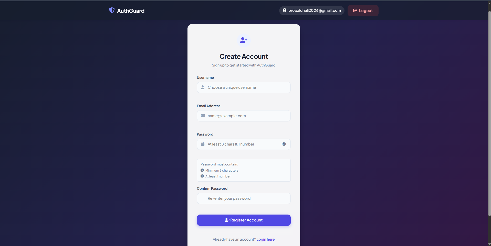
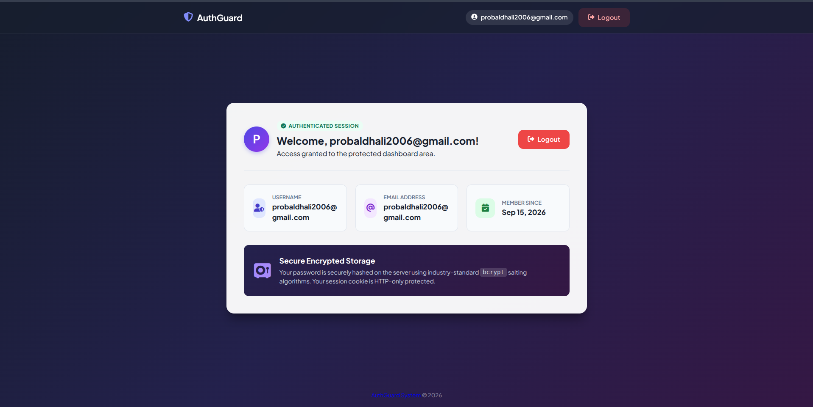

# 🛡️ AuthGuard — Login Authentication System

A modern, secure, and responsive **Login Authentication System** built with HTML, CSS, JavaScript, Node.js, and Express.

The project provides a complete authentication flow with **user registration, login, password validation, protected dashboard access, session handling, and logout functionality**.

---

## 📌 OASIS INFOBYTE Internship

**Internship:** Web Development & Designing  
**Level:** 02  
**Task:** 04 — Login Authentication System  
**Developer:** Probal Dhali  
**Year:** 2026

---

## ✨ Features

### 🔐 Authentication
- User registration
- Username and email authentication
- Secure login system
- Protected dashboard
- Logout functionality
- Session-based authentication
- HTTP-only session cookie

### 👤 Registration
- Unique username validation
- Email validation
- Password validation
- Confirm password validation
- Live password requirement indicators
- Minimum 8 characters
- At least 1 number

### 🔑 Login
- Login using username or email
- Password visibility toggle
- Form validation
- Loading spinner
- Error messages
- Authentication status handling

### 📊 Protected Dashboard
After successful authentication, users can access a protected dashboard containing:

- User avatar
- Username
- Email address
- Account creation date
- Authentication session status
- Secure storage information
- Logout button

### 🎨 User Interface
- Modern authentication interface
- Responsive design
- Clean card-based layout
- Font Awesome icons
- Google Fonts
- Navigation between Login and Register
- Alert/toast notification system
- Mobile-friendly layout

---

## 🖥️ Project Preview

### 🔐 Login Page

<p align="center">
  
</p>

### 📝 Registration Page

<p align="center">
  
</p>

### 📊 Protected Dashboard

<p align="center">
  
</p>

> 📌 Add your actual screenshots inside:
>
> `assets/images/authguard-login.png`  
> `assets/images/authguard-register.png`  
> `assets/images/authguard-dashboard.png`

---

## 🧰 Technologies Used

| Technology | Purpose |
|---|---|
| HTML5 | Application structure |
| CSS3 | Styling and responsive UI |
| JavaScript | Frontend interaction and validation |
| Node.js | Backend runtime |
| Express.js | Web server and API handling |
| JSON | User data storage |
| bcrypt | Password hashing |
| HTTP-only Cookies | Session protection |
| Font Awesome | Icons |
| Google Fonts | Typography |

---

## 📂 Project Structure

```text
TASK 4 · Login Authentication System/
│
├── data/
│   └── users.json
│
├── public/
│   ├── css/
│   │   └── styles.css
│   │
│   ├── js/
│   │   ├── app.js
│   │   └── auth.js
│   │
│   └── index.html
│
├── package.json
├── package-lock.json
├── server.js
├── test-auth.js
└── README.md
```

---

## 📄 File Description

### `server.js`

Main Express.js backend server.

Responsible for:

- Starting the application server
- Handling authentication requests
- Registration
- Login
- Logout
- Session management
- Password hashing
- Protected routes
- Serving frontend files

---

### `public/index.html`

Main frontend interface containing:

- Login form
- Registration form
- Protected dashboard
- Navigation bar
- Alert system
- Footer

The application provides separate Login, Register, and protected Dashboard views. :contentReference[oaicite:2]{index=2} :contentReference[oaicite:3]{index=3}

---

### `public/css/styles.css`

Contains all UI styling, including:

- Authentication cards
- Forms
- Buttons
- Navigation
- Dashboard
- Responsive layout
- Alerts
- Password requirement badges

---

### `public/js/auth.js`

Handles authentication-related frontend functionality such as:

- Login requests
- Registration requests
- Authentication state
- Logout
- Password visibility
- Form handling

---

### `public/js/app.js`

Controls the frontend application interface and interactions.

---

### `data/users.json`

Stores registered user information for the project.

> ⚠️ For production applications, a real database should be used instead of a JSON file.

---

### `test-auth.js`

Contains authentication tests for verifying the backend authentication functionality.

---

## 🔐 Password Security

AuthGuard uses password hashing with **bcrypt** rather than storing plain-text passwords.

The dashboard also communicates that passwords are hashed using bcrypt and that the session cookie is HTTP-only protected. :contentReference[oaicite:4]{index=4}

### Password Requirements

A valid password must contain:

```text
✓ Minimum 8 characters
✓ At least 1 number
```

These requirements are also displayed live during registration. :contentReference[oaicite:5]{index=5}

---

## 🚀 How to Run

### 1. Clone the Repository

```bash
git clone https://github.com/probal2005/YOUR-REPOSITORY-NAME.git
```

### 2. Enter the Project

```bash
cd "TASK 4 · Login Authentication System"
```

### 3. Install Dependencies

```bash
npm install
```

### 4. Start the Server

```bash
npm start
```

The server runs on:

```text
http://localhost:3000
```

### 5. Open in Browser

Open:

```text
http://localhost:3000
```

---

## 🧪 Run Authentication Tests

The project includes `test-auth.js`.

Run:

```bash
npm test
```

or:

```bash
node test-auth.js
```

---

## 🔄 Authentication Flow

```text
                    ┌──────────────────┐
                    │     AuthGuard     │
                    └────────┬─────────┘
                             │
                ┌────────────┴────────────┐
                │                         │
             Login                    Register
                │                         │
                ▼                         ▼
       Validate Credentials       Validate User Data
                │                         │
                ▼                         ▼
       Authenticate User          Hash Password
                │                         │
                └────────────┬────────────┘
                             │
                             ▼
                   Create Auth Session
                             │
                             ▼
                  ┌────────────────────┐
                  │ Protected Dashboard│
                  └─────────┬──────────┘
                            │
                            ▼
                          Logout
                            │
                            ▼
                     Login Screen
```

---

## 🧭 Application Views

### 1. Login View

Users enter:

- Username or Email
- Password

The login interface provides validation and password visibility controls. :contentReference[oaicite:6]{index=6}

---

### 2. Register View

Users provide:

- Username
- Email Address
- Password
- Confirm Password

The password section displays live requirements while the user types. :contentReference[oaicite:7]{index=7}

---

### 3. Protected Dashboard

After successful authentication, the dashboard displays:

```text
Authenticated Session

Welcome, User!

Username
Email Address
Member Since

Secure Encrypted Storage
```

A logout button allows the user to terminate the authenticated session. :contentReference[oaicite:8]{index=8}

---

## 🛡️ Security Features

AuthGuard demonstrates several basic web authentication security practices:

- Password hashing with bcrypt
- Password confirmation
- Input validation
- Protected dashboard
- Session-based authentication
- HTTP-only cookies
- Logout/session termination
- Username/email authentication
- Password visibility controls

> **Note:** This is an educational internship project and should not be considered production-ready authentication without additional security hardening.

---

## 📱 Responsive Design

The interface is designed to work across:

- 💻 Desktop
- 💻 Laptop
- 📱 Mobile
- 📲 Tablet

---

## 🎯 Learning Objectives

This project demonstrates practical understanding of:

- Frontend form design
- Form validation
- JavaScript DOM manipulation
- Client-server communication
- Express.js
- Node.js authentication
- Password hashing
- Session management
- HTTP-only cookies
- Protected routes
- JSON-based data storage
- Authentication testing

---

## 🧩 Future Improvements

Possible improvements include:

- MongoDB / PostgreSQL database
- JWT authentication
- Refresh tokens
- Email verification
- Password reset
- Two-factor authentication (2FA)
- Rate limiting
- CAPTCHA
- Account lockout protection
- CSRF protection
- HTTPS
- Role-based access control
- Admin dashboard
- OAuth / Google login

---

## ⚠️ Security Disclaimer

This project is created for **educational and internship purposes**.

For a production authentication system, additional protections should be implemented, including:

- HTTPS
- Secure cookie configuration
- CSRF protection
- Rate limiting
- Strong session management
- Database security
- Input sanitization
- Security headers
- Environment-based secrets
- Account recovery mechanisms

Never store real production credentials or sensitive personal information in `users.json`.

---

## 👨‍💻 Developer

**Probal Dhali**

Web Development & Designing Intern

GitHub:

https://github.com/probal2005

---

## 🏆 Internship Task

This project was developed as part of:

**OASIS INFOBYTE — Web Development & Designing Internship**

```text
Level 02
Task 04
Login Authentication System
```

---

## 📜 License

This project is intended for educational purposes.

© 2026 Probal Dhali. All Rights Reserved.

---

## ⭐ Acknowledgement

Thanks to **OASIS INFOBYTE** for providing the internship opportunity and practical web development tasks.

---

<p align="center">
  <b>🛡️ AuthGuard System © 2026</b>
</p>

<p align="center">
  Built with HTML, CSS, JavaScript, Node.js & Express.js
</p>